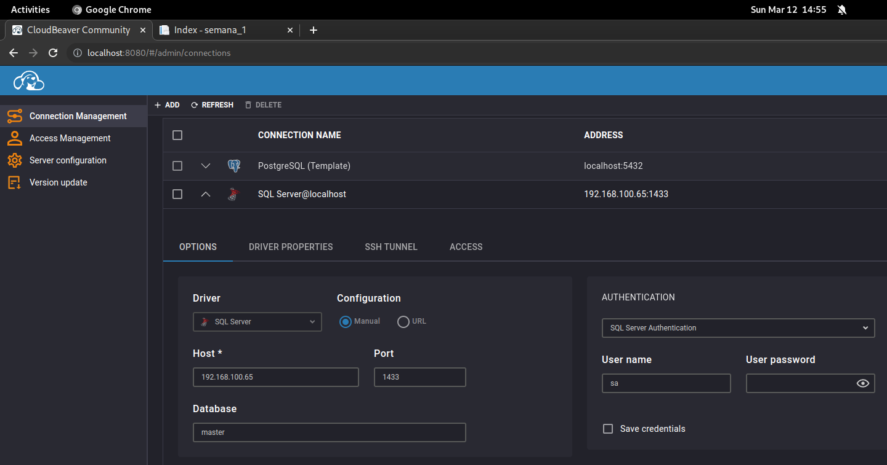
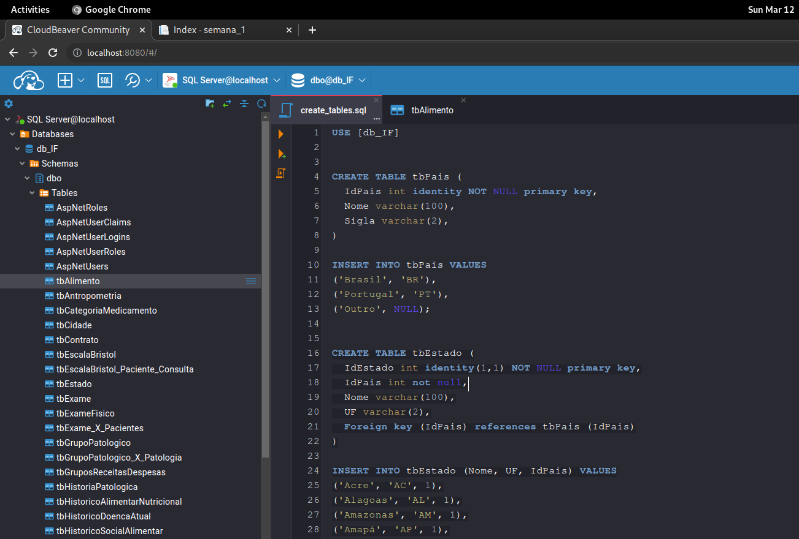
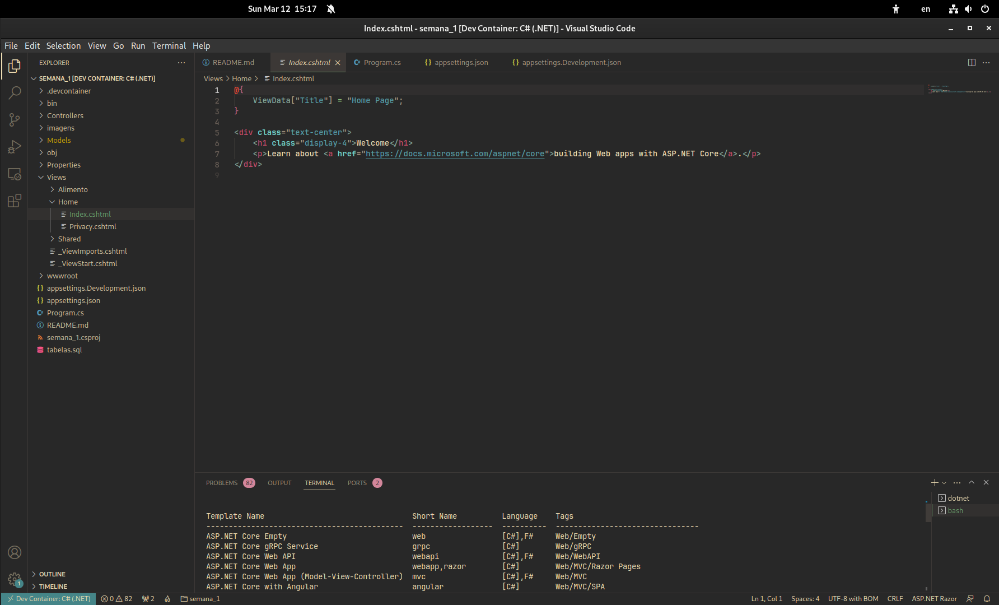
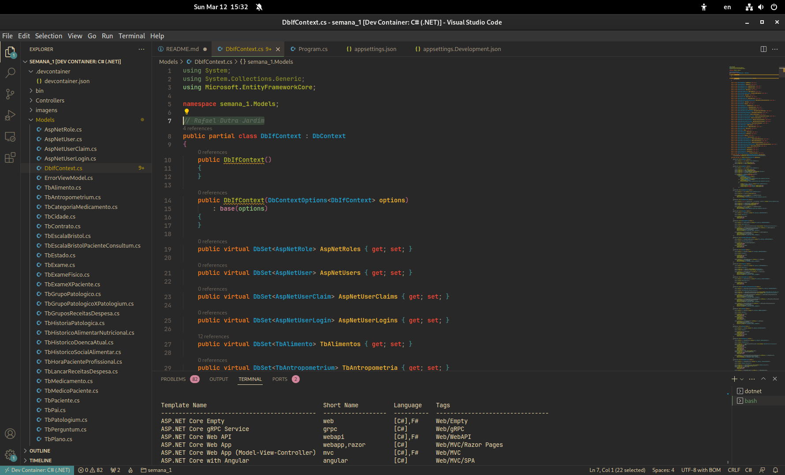
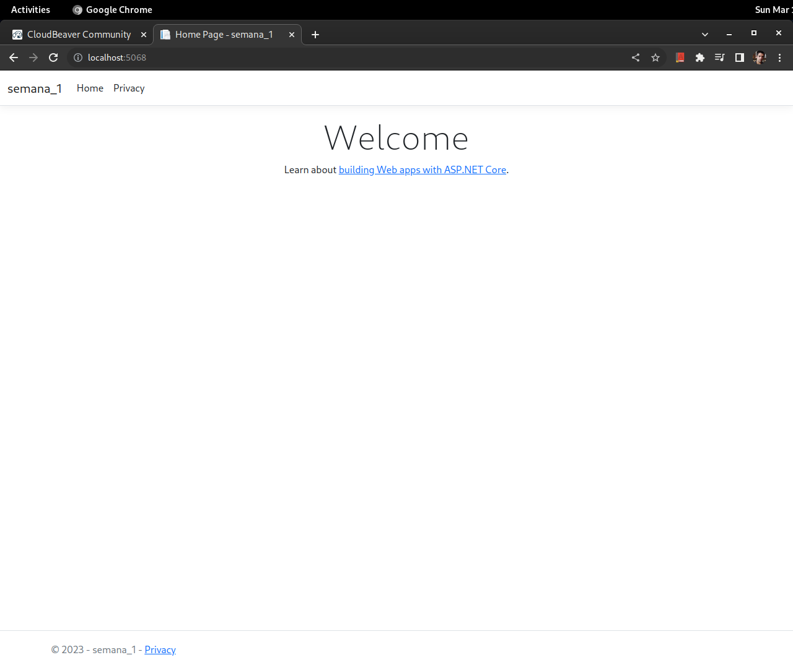
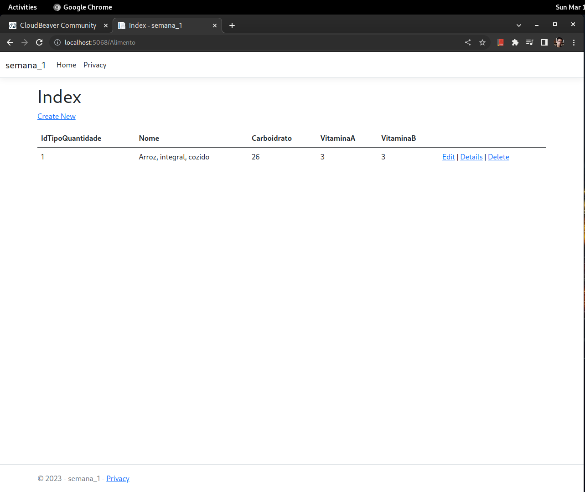
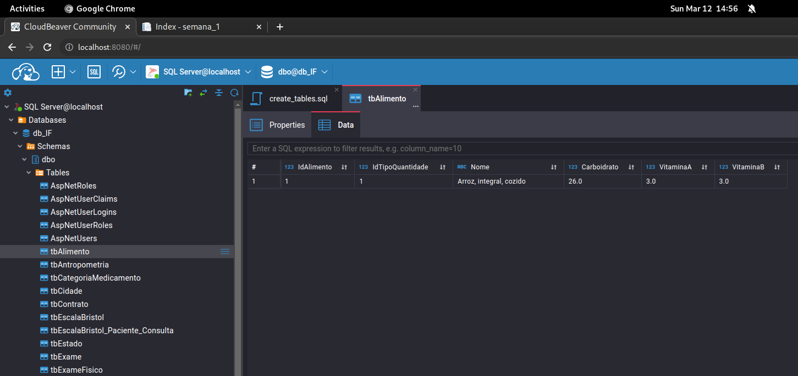

# Primeira atividade

Para a primeira ativade foi solicitado seguir as etapas da primeira aula, na qual é demonstrado as seguintes tarefas:

- Configuração de um gerenciado banco de dados Microsoft SQL Server;
- Criação de tabelas com script sql fornecido na atividade;
- Criação de um novo projeto com o template  "Aplicação WEB Asp.Net (.Net Framework)";
- Criação de modelos de entidades a partir do banco de dados criado;
- Criação de um controlador (e views) a partir de um modelo de entidade escolhido dentre os criados.

## Resolução

Durante a resolução, algumas atividades foram adaptadas de forma a possibilitar seu desenvolvimento em ambiente linux. Buscando encapsular as dependências, foi utilizado containers com Docker.

### Configuração de um gerenciador de banco de dados Microsoft SQL Server

Para o banco de dados foi utilizado a imagem docker `mcr.microsoft.com/mssql/server:2022-latest`. O comando abaixo inicializa o container mapeando o diretório da dados do sql server, `/var/opt/mssql`, para um diretório local, `/home/rafael/data/mssql`, a fim de que caso o cantainer seja finalizado, seja possível inicializa-lo novemento com os dados salvos anteriormentes.

Para esta atividade, a senha do usuário SA (admin) foi configurada como `YourStrong@Passw0rd`. O serviço do SGDB disponíbilizado na porta 1433 do container foi mapeado para o host, também na porta 1433.


```
docker run -e "ACCEPT_EULA=Y" -e "MSSQL_SA_PASSWORD=YourStrong@Passw0rd" \
   -p 1433:1433 --name sql1 --hostname sql1 \
   -v /home/rafael/data/mssql:/var/opt/mssql \
   --user root \
   -d mcr.microsoft.com/mssql/server:2022-latest
```

Ainda, durante a primeira aula foi demonstrato como executar o script sql fornecido utilizando o `SQL Server Management Studio (SSMS)`. Porém, conforme documentação de instalação do SSMS, listada nas referências, o SSMS requer o sistema operacional Windows, logo, optei por utilizar a imagem docker `dbeaver/cloudbeaver:latest` do Cloud Beaver como alternativa e continuei em ambiente linux.

O serviço do Cloud Beaver, disponibilizado por padão na porta 8978 do container, foi mapeado para o servidor local na porta 8080.


```
docker run --name cloudbeaver --rm -ti -p 8080:8978 \
   -v /home/rafael/data/cloudbeaver:/opt/cloudbeaver/workspace \
   -d --restart unless-stopped \
   dbeaver/cloudbeaver:latest
```

Para configuração da conexão do Beaver com o MSSQL foi utilizado o IP da maquina host, isto considerando que o dns `localhost` da conteiner do Beaver redireciona para o IP do container, e ainda o IP do host é trocado com menor frequência.



### Criação de tabelas com script sql fornecido na atividade

O script sql para criação das tabelas da atividade foi copiado para a raiz do projeta desta atividade no github com o nome `tabelas.sql`. O Cloud Beaver permite executar scripts a partir de um editor web. Para criação da tabela o código do script foi copiado para o editor e executado.




### Criação de um novo projeto com o template  "Aplicação WEB Asp.Net (.Net Framework)"

Na primeira aula, foi criado um novo projeto utilizando o Visual Studio, contudo, na página de download do Visual Studio não é disponibilizado um versão para linux e na mesma página é sugerido o Visual Studio Code como uma alternativa para linux.

Algumas facilidades fornecidas pelo Visual Studio, como criação de projetos a partir de templates, não estão presentes por padrão no Visual Studio Code na forma gráfica, logo foi utilizado alguns recursos do dotnet cli para continuação da atividade. 

Para esta atividade foi utilizado o plugin Dev Container do VS Code que nos permite inicializar a IDE dentro de um container docker. O arquivo de configuração esta presente no repositório github desta atividade, no diretório `.devcontainer/`, e foi utilizado a imagem `mcr.microsoft.com/devcontainers/dotnet:0-7.0`.

Para gerar um novo projeto a partir de um template foi utilizado o comando abaixo:

```
dotnet new mvc
```

Durante a aula, o projeto foi criado com o template `Aplicação Web Asp.Net (.Net Framework)`, porém na resolução da atividade foi utilizado o template `ASP.NET Core Web App (Model-View-Controller)`, este último é bem parecido com o demonstrado na aula, só que neste não estão presentes alguns documentos HTML de apresentação inicial. 



### Criação de modelos de entidades a partir do banco de dados criado

Para utilização do `dotnet ef` (Entity Framework CLI) que é responsável pela criação dos modelos de entidades, foi necessário a instalação do mesmo. O seguinte comando é utilizado para a instalação desta ferramenta:

```
dotnet tool install --global dotnet-ef
```

O seguinte comando, aqui ajustado para o ambiente de desenvolvimento dentro do container, foi necessário para indicar o caminho das ferramentas instaladas:

```
export PATH="$PATH:/home/vscode/.dotnet/tools"
```

Ainda, foi necessário adicionar os seguintes pacotes:

```
dotnet add package Microsoft.EntityFrameworkCore.SqlServer
dotnet add package Microsoft.EntityFrameworkCore.SqlServer.Design
dotnet add package Microsoft.EntityFrameworkCore.Tools
```

Antes de criar os modelos, configurei uma string com as informações de conexão a base de dados conforme comandos abaixo:

```
dotnet user-secrets init
dotnet user-secrets set ConnectionStrings:DefaultConnection \
   "Server=192.168.100.65;Database=db_IF;User=SA;Password=YourStrong@Passw0rd;Trusted_Connection=False;TrustServerCertificate=True"
```

Considerando que o projeto é executado dentro de um container, para o endereço do SGDB foi utilizado o IP da máquina host, para o qual o serviço do MSSQL foi mapeado. 

A partir deste ponto, foi possível gerar os modelos de entidades a partir do banco de dados existente com o seguinte comando:

```
dotnet ef dbcontext \
   scaffold Name=ConnectionStrings:DefaultConnection \
   Microsoft.EntityFrameworkCore.SqlServer -o Models
```




Em seguinda, adicionei a configuração de serviço para o contexto de dados, adicionando a seguinte linha ao arquivo Program.cs:

```
builder.Services.AddDbContext<DbIfContext>(options => options.UseSqlServer("Name=ConnectionStrings:DefaultConnection"));
```

### Criação de um controlador (e views) a partir de um modelo de entidade escolhido dentre os criados

De forma análoga ao `dotnet ef`, para gerar os controladores e views, precisamos de adicionar a ferramenta `aspnet-codegenerator`. Utilizei o seguinte comando do dotnet para instalar esta ferramenta:


```
dotnet tool install -g dotnet-aspnet-codegenerator
```

Ainda, foi necessário adicionar os seguintes pacotes:


```
dotnet add package Microsoft.VisualStudio.Web.CodeGenerators.Mvc 
dotnet add package Microsoft.VisualStudio.Web.CodeGeneration.Design
```

A fim de gerando o controlador e views para o modelo TbAlimento, executei o seguinte comando:

```
dotnet aspnet-codegenerator controller -name AlimentoController -m TbAlimento -dc DbIfContext --relativeFolderPath Controllers --useDefaultLayout
```

Inicializei o sevidor web com o seguinte comando:

```
dotnet watch
```





References:

Abaixo relacionei alguns textos que auxiliaram à adaptar os procedimentos executados na aula em ambiente Windows para o ambiente linux.

- [CloudBeaver Documentation](https://dbeaver.com/docs/cloudbeaver/Run-Docker-Container/)
- [dotnet aspnet-codegenerator](https://learn.microsoft.com/en-us/aspnet/core/fundamentals/tools/dotnet-aspnet-codegenerator?view=aspnetcore-7.0)
- [Entity Framework  Entity Framework Core Installing Entity Framework Core](https://learn.microsoft.com/pt-br/ef/core/get-started/overview/install)
- [Reverse Engineering](https://learn.microsoft.com/en-us/ef/core/managing-schemas/scaffolding/?tabs=dotnet-core-cli)
- [Baixar o SQL Server Management Studio (SSMS) - Sem suporte para linux](https://learn.microsoft.com/pt-br/sql/ssms/download-sql-server-management-studio-ssms?view=sql-server-ver16)
- [ASP .NET Core - Scaffolding : criando Controllers e Views via linha de comando - I](https://www.macoratti.net/17/12/aspcore_ctrlcmd1.htm)
- [ASP .NET Core - Scaffolding : criando Controllers e Views via linha de comando - II](https://www.macoratti.net/17/12/aspcore_ctrlcmd2.htm)
- [ASP .NET Core - Gerando as entidades, controllers e views na linha de comando](https://www.macoratti.net/18/01/aspcore_scfdlcmd1.htm)