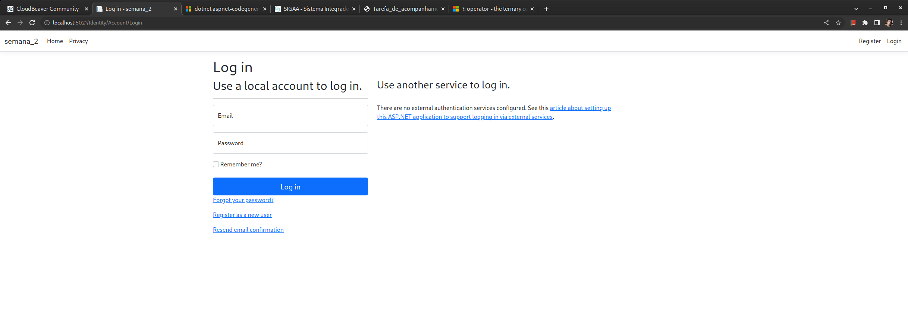
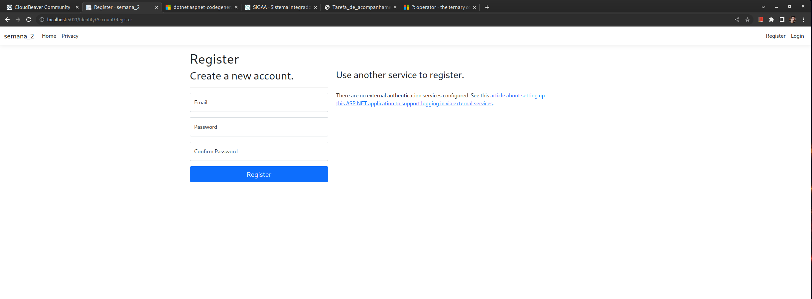
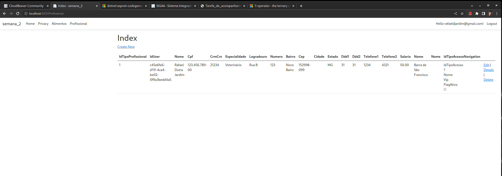
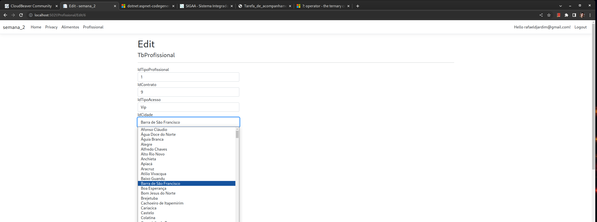
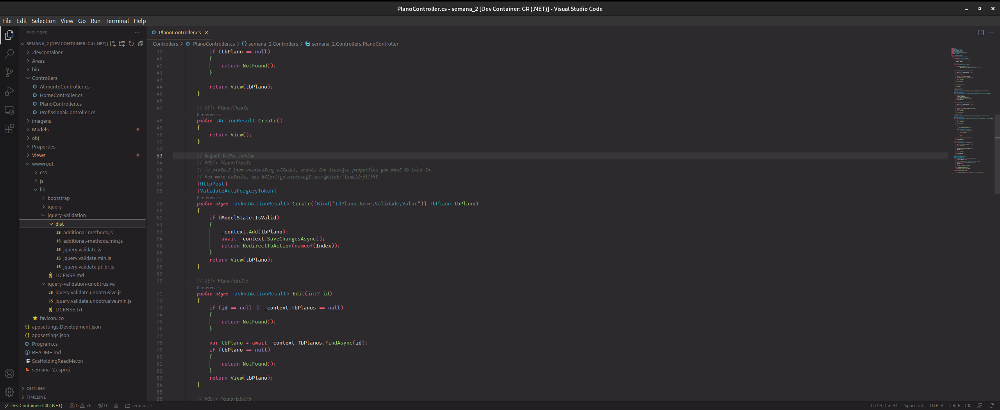

# Segunda e Terceira atividades

Para a segunda atividade foi solicitado seguir as etapas da segunda e terceira aula, nas quais é demonstrado as seguintes tarefas:

- Criação e configuração de um novo projeto utilizando a base de dados da atividade da primeira aula;
- Criação de modelos de entidades a partir do banco de dados;
- Implementação do sistema de autenticação gerado automático, configurando ele para utilizar a base de dados criada anteriormente;
- Criação de um controlador/views a partir do modelo de entidade de Profissional;
- Alteração no controlador Profissional para apresentar o plano;
- Trabalhar com ModelState;
- Alterar a validação do JQuery para utilizar vírgula como separador de decimal.

Foi dado continuidade ao projeto de forma a também preencher os seguintes requisitos:

1. O sistema deverá permitir que o próprio profissional se cadastre. Deverá haver duas opções de registro do profissional: o registro como Médico e o registro como Nutricionista. Utilize para isso duas autorizações (Roles) diferentes. Essa possibilidade de escolha deve ser clara, facilmente acessível e estar disponível a quem desejar se registrar no site. As opções disponíveis ao profissional quanto ao seu próprio cadastro, depois de efetivado, serão somente a edição (Edit) e a visualização (Details). Na edição não deverá ser possível alterar o campo CPF. Um médico ou nutricionista só deverá ter acesso a seus próprios dados, sendo inacessível qualquer informação de outros profissionais.

2. Crie três usuários especiais (Gerentes) e associe suas autorizações (Roles) diretamente no Banco de Dados. Um usuário possuirá a autorização de GerenteMédico, o segundo de GerenteNutricionista e o terceiro de GerenteGeral. O GerenteMédico só deverá ter acesso aos profissionais médicos cadastrados. O GerenteNutricionista, os profissionais Nutricionistas. Já o GerenteGeral terá acesso a todos os profissionais. Os gerentes poderão editar (Edit), visualizar (Details) e excluir (Delete) profissionais, no entanto não poderão criá-los (Create). Aqui não há a restrição de alteração de CPF, os gerentes podem editá-lo como qualquer outro campo normalmente. Só permita a exclusão de profissionais que não possuem pacientes cadastrados.

3. Cada profissional (Médico ou Nutricionista) terá as opções de criar, editar, visualizar e excluir pacientes (Create, Edit, Details, Delete). Também deverá ter acesso a uma lista dos pacientes que cadastrou. Somente os pacientes cadastrados pelo próprio profissional deverão estar disponíveis na lista, bem como suas respectivas opções (Edit, Details, Delete).

## Resolução

### Implementação do sistema de autenticação

Para disponibilizar os comandos de criação do sistema de autenticação a partir do dotnet-aspnet-codegenerator foi necessária a intalação dos seguintes pacotes:

```bash
dotnet add package Microsoft.AspNetCore.Identity.EntityFrameworkCore
dotnet add package Microsoft.AspNetCore.Identity.UI
```

Em seguida, foi gerado o sistema de autenticação já configurado para o contexto da base de dados criada com o seguinte comando:

```bash
dotnet aspnet-codegenerator identity -dc DbIfContext --files "Account.Register;Account.Login;Account.Logout"
```
Com as configurações geradas anteriormente, ao tentar gerar o sistema de autenticação, o seguinte erro foi lançado pelo codegenerator:

- **DbContext type 'DbIfContext' is found but it does not inherit from 'Microsoft.AspNetCore.Identity.EntityFrameworkCore.IdentityDbContext'**

Para resolver a dependência de herança, a class DbIfContext no arquivo DbIfContext.cs foi alterada para herdar de IdentityDbContext, sendo que anteriormente estava herdando de DbContext. Ainda foi necessário passar o compilador de modelo para a classe base com a linha `base.OnModelCreating(modelBuilder);`.

No arquivo `Program.cs` foi editado de forma a corrigir a string de conexão com a base de dados gerada e foi adicionado a linha `app.MapRazorPages();` para gerar o sitema de rotas.
No arquivo de layout foi adicionado a linha `<partial name="_LoginPartial" />` no menu para adicionar a navegação de autenticação.
Também no arquivo Program.cs foi configurado para não exigir confirmação de e-mail para efetuar o login.




#### Conflitos

Para configuração do sistema de autenticação foi necessário remover as entidades mapeadas automaticamentes das tabelas de usuário/papéis deveido a mudança na versão da framework utilizada aqui e na apresentação da atividade. Neste processo foi também removida as tabelas, e elas foram recriadas utilizando o sistema de migração do Entity Framework com os comandos abaixo:

```bash
dotnet ef migrations add CreateIdentitySchema
dotnet ef database update
```

## Adição do controlador e interfaces para a entidade Profissional

De forma semelhante a utilizada para gerar o controlador de alimento na última atividade, o controlador para a entidade Profissional foi adicionada conforme abaixo:

```bash
dotnet aspnet-codegenerator controller -name ProfissionalController -m TbProfissional -dc DbIfContext --relativeFolderPath Controllers --useDefaultLayout
```




## Alterar a validação do JQuery para utilizar vírgula como separador de decimal

Foi adicionado o arquivo com o script que sobrescreve a função de validação na pasta `wwwroot/lib/jquery-validation/dist`. Também foi necessário alterar o arquivo `Views/Shared/_ValidationsScriptsPartial.cshtml` para incluir o novo arquivo de script. Em seguida, para que a página desejada, aqui o Create do TbPlano, carregar os scripts de validação, o seguinte fragmento de código foi adicionado ao final da view:

```cshtml
@section Scripts {
    <partial name="_ValidationScriptsPartial" />
}
```

Obs. Apesar da validação permitir utilizar vírgula, o valor é salvo o numeral sem a vírgula, assim 13,5 se torna 135. Mais trabalho será necessário para fazer isto funcionar da forma desejada. 



## Referências

Abaixo relacionei alguns textos que auxiliaram na realização da segunda atividade, visto que foram necessárias algumas adaptações na realização da atividade devido a escolha por um ambiente de desenvovimento e versão de frameworks diferente das demonstradas nas aulas:

- [Scaffold Identity in ASP.NET Core projects](https://learn.microsoft.com/en-us/aspnet/core/security/authentication/scaffold-identity?source=recommendations&view=aspnetcore-7.0&tabs=netcore-cli)