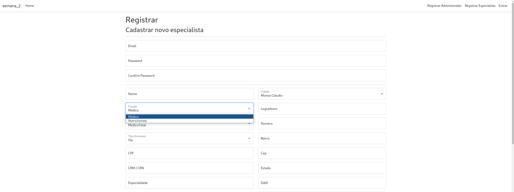
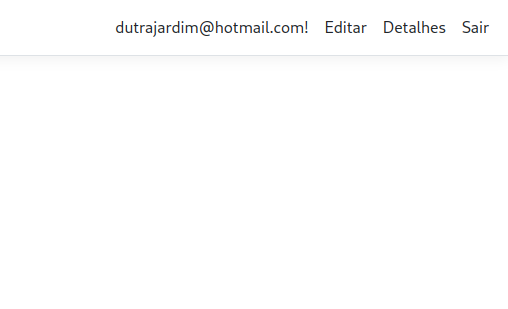

# Segunda e Terceira atividades

## Requisitos terceira atividade

Foi dado continuidade ao projeto da segunda atividade de forma a também preencher os seguintes requisitos:

1. O sistema deverá permitir que o próprio profissional se cadastre. Deverá haver duas opções de registro do profissional: o registro como Médico e o registro como Nutricionista. Utilize para isso duas autorizações (Roles) diferentes. Essa possibilidade de escolha deve ser clara, facilmente acessível e estar disponível a quem desejar se registrar no site. As opções disponíveis ao profissional quanto ao seu próprio cadastro, depois de efetivado, serão somente a edição (Edit) e a visualização (Details). Na edição não deverá ser possível alterar o campo CPF. Um médico ou nutricionista só deverá ter acesso a seus próprios dados, sendo inacessível qualquer informação de outros profissionais.

2. Crie três usuários especiais (Gerentes) e associe suas autorizações (Roles) diretamente no Banco de Dados. Um usuário possuirá a autorização de GerenteMédico, o segundo de GerenteNutricionista e o terceiro de GerenteGeral. O GerenteMédico só deverá ter acesso aos profissionais médicos cadastrados. O GerenteNutricionista, os profissionais Nutricionistas. Já o GerenteGeral terá acesso a todos os profissionais. Os gerentes poderão editar (Edit), visualizar (Details) e excluir (Delete) profissionais, no entanto não poderão criá-los (Create). Aqui não há a restrição de alteração de CPF, os gerentes podem editá-lo como qualquer outro campo normalmente. Só permita a exclusão de profissionais que não possuem pacientes cadastrados.

3. Cada profissional (Médico ou Nutricionista) terá as opções de criar, editar, visualizar e excluir pacientes (Create, Edit, Details, Delete). Também deverá ter acesso a uma lista dos pacientes que cadastrou. Somente os pacientes cadastrados pelo próprio profissional deverão estar disponíveis na lista, bem como suas respectivas opções (Edit, Details, Delete).


## Requisitos segunda atividade

Para a segunda atividade foi solicitado seguir as etapas da segunda e terceira aula, nas quais é demonstrado as seguintes tarefas:

- Criação e configuração de um novo projeto utilizando a base de dados da atividade da primeira aula;
- Criação de modelos de entidades a partir do banco de dados;
- Implementação do sistema de autenticação gerado automático, configurando ele para utilizar a base de dados criada anteriormente;
- Criação de um controlador/views a partir do modelo de entidade de Profissional;
- Alteração no controlador Profissional para apresentar o plano;
- Trabalhar com ModelState;
- Alterar a validação do JQuery para utilizar vírgula como separador de decimal.

## Resolução terceira atividade

### Primeiro requisito:

> O sistema deverá permitir que o próprio profissional se cadastre. Deverá haver duas opções de registro do profissional: o registro como Médico e o registro como Nutricionista. Utilize para isso duas autorizações (Roles) diferentes. Essa possibilidade de escolha deve ser clara, facilmente acessível e estar disponível a quem desejar se registrar no site. As opções disponíveis ao profissional quanto ao seu próprio cadastro, depois de efetivado, serão somente a edição (Edit) e a visualização (Details). Na edição não deverá ser possível alterar o campo CPF. Um médico ou nutricionista só deverá ter acesso a seus próprios dados, sendo inacessível qualquer informação de outros profissionais.

Aqui foi utilizado o próprio sistema de cadastro gerado pelo **Identity**, aproveitando a página de registro (*./Areas/Identity/Pages/Register.cshtml*) e o controlador/modelo de registro (*./Areas/Identity/Pages/Register.cshtml.cs*). Assim foi adicionado um parametro (query) para separar a lógica de cadastro em **Registro de Administrador** e **Registro de Especialista**, utilizando os mesmos documentos, página e modelo de página, do Identity. Para o Registro de Especialista foi disponibilizado o campo Função para atender o cadastro de Médicos e Nutricionistas.



Servindo como controlador a class RegisterModel gerada pelo *codegenarator* possui o atributo Input que serve como modelo para os dados de cadastro e é utilizado com a característica *BindProperty* que implica em configurar o atributo Input com os dados advindos do formulário de registro. A fluxo de registro normal do Identity foi utilizado para cadastrar os Administradores, os quais *são registrados sem nenhum Papel (Role) associado a ele*, e caso seja passado uma flag para a página de registro e modelo de página, é então apresentado o registro de especialista, sendo que neste registro já será salvo tando o usuário, seu papel (Role) e dados de profissional na tabela *TbProfissional*.

Para apresentação dos campos adicionais quando necessário o cadastro de profissional, a função que retorna a página foi estruturada da sequinte forma:

```cs
/// <summary>
///     Função responsável por retornar o formulário de criação de um usuário
///     sendo ele profissional ou gestor
/// </summary>
public async Task OnGetAsync(string returnUrl = null)
{
    ReturnUrl = returnUrl;
    ExternalLogins = (await _signInManager.GetExternalAuthenticationSchemesAsync()).ToList();

    // verifica se é solicitado cadastro pra profissional especialista
    if (Request.Query["professional"] == "True")
    {
        ViewData["isProfessional"] = "True";
        setViewData();
    }
    // caso contrario define a flag como false para deixar o formulário
    // com os campos apenas de gestor
    else
    {
        ViewData["isProfessional"] = "False";
    }
}
```

Já no documento de renderização foi incluido a renderização condicional da seguinte forma:

```html
@if (ViewBag.isProfessional == "True")
{
    <hr />
    <div class="row">
        <div class="col-md-6">
            <div class="form-floating mb-3">
                <input asp-for="TbProfissional.Nome" class="form-control" placeholder="nome" />
                <label asp-for="TbProfissional.Nome">Nome</label>
                <span asp-validation-for="TbProfissional.Nome" class="text-danger"></span>
            </div>
            <div class="form-floating mb-3">
                <select asp-for="Role.Name" class="form-select" asp-items="ViewBag.Role"></select>
                <label asp-for="Role.Name">Função</label>
                <span asp-validation-for="Role.Name" class="text-danger"></span>
            </div>
```

Após registro e inicializada a sessão, é apresentado ao usuário a opção de ediçao e visualização de detalhes no canto superior esquerdo da aplicação:



Para renderizar as páginas apresentadas nestas estas funcionalidades, foi aproveitada as mesmas páginas que serão apresentadas aos gestores para edição dos profissionais, contudo o contralador utilizado foi específico para estes usuários de forma a garantir que eles só poderão atualizar seus dados, aqui atrelando a esta funcionalidade a sessão ativa. Segue abaixo o código destes controladores:

Para a funcionalidade de apresentação de detalhes:

```cs
// GET: Profissional/Details
/// <summary>
///     Funçao responsável por retornar detalhes de profissional
///     especialista conectado
/// </summary> 
[Authorize(Roles = "Nutricionista,Médico")]
public async Task<IActionResult> LoggedInDetails()
{
    // consulta identificador de profissional conectado
    var userid = User.FindFirstValue(ClaimTypes.NameIdentifier) ?? throw new ArgumentNullException("Mandatory parameter user");

    // consulta dados profissionais de usuário conectado
    var tbProfissional = await _context.TbProfissionals
        .Include(t => t.IdCidadeNavigation)
        .Include(t => t.IdContratoNavigation)
        .Include(t => t.IdTipoAcessoNavigation)
        .FirstOrDefaultAsync(m => m.IdUser.Equals(userid));

    if (tbProfissional == null)
    {
        return NotFound();
    }

    return View("Details", tbProfissional);
}
```

Para a funcionalidede de retorno de formulário de edição:

```cs
// Get: Profissional/LoggedInEdit
/// <summary>
///     Funçao responsável por retornar o formulário de edição profissional
///     especialista conectado
/// </summary> 
[Authorize(Roles = "Nutricionista,Médico")]
public async Task<IActionResult> LoggedInEdit()
{
    // consulta identificador de profissional conectado
    var userid = User.FindFirstValue(ClaimTypes.NameIdentifier) ?? throw new ArgumentNullException("Mandatory parameter user");

    // consulta dados profissionais de usuário conectado
    var tbProfissional = await _context.TbProfissionals.Where(prof => prof.IdUser.Equals(userid)).FirstAsync();
    if (tbProfissional == null)
    {
        return NotFound();
    }

    return getResult(tbProfissional);
}
```

Para a funcionalidade de atualização de dados:

```cs
// Post: Profissional/LoggedInEdit
/// <summary>
///     Funçao responsável por atualiza os dados do profissional
///     especialista conectado
/// </summary> 
[HttpPost]
[ValidateAntiForgeryToken]
[Authorize(Roles = "Nutricionista,Médico")]
public async Task<IActionResult> LoggedInEdit([Bind("IdProfissional,IdTipoProfissional,IdContrato,IdTipoAcesso,IdCidade,Nome,CrmCrn,Especialidade,Logradouro,Numero,Bairro,Cep,Cidade,Estado,Ddd1,Ddd2,Telefone1,Telefone2,Salario")] TbProfissional tbProfissional)
{
    // consulta identificador de profissional conectado
    var userid = User.FindFirstValue(ClaimTypes.NameIdentifier) ?? throw new ArgumentNullException("Mandatory parameter user");

    // consulta dados profissionais de usuário conectado
    var profissionalData = await _context.TbProfissionals
    .Where(t => t.IdUser.Equals(userid)).Select(t => new { t.IdProfissional, t.Cpf }).FirstAsync();

    // garante que só dará sequencia se identificador de profissional for
    // realmento o relacionado ao usuário proprietário da sessão atual
    if (profissionalData.IdProfissional != tbProfissional.IdProfissional)
    return NotFound();

    // Remove validação de campos que serão de responsabilidade
    // do controlador preencher 
    ModelState.Remove("IdUser");
    ModelState.Remove("Cpf");

    // valida os dados
    if (ModelState.IsValid)
    {
        try
        {
            // preenche os dados que não são permitidos alterar
            tbProfissional.IdUser = userid;
            tbProfissional.Cpf = profissionalData.Cpf;

            // salva os dados de edição
            _context.Update(tbProfissional);
            await _context.SaveChangesAsync();
            return RedirectToAction(nameof(LoggedInDetails));
        }
        // trata exceções de atualização concorrente
        catch (DbUpdateConcurrencyException)
        {
            if (!TbProfissionalExists(tbProfissional.IdProfissional))
            return NotFound();
            else
            ModelState.AddModelError("", "Unable to save changes. Try again, and if the problem persists, see your system administrator.");
        }
    }

    return getResult(tbProfissional);
}
```

### Segundo requisito

> Crie três usuários especiais (Gerentes) e associe suas autorizações (Roles) diretamente no Banco de Dados. Um usuário possuirá a autorização de GerenteMédico, o segundo de GerenteNutricionista e o terceiro de GerenteGeral. O GerenteMédico só deverá ter acesso aos profissionais médicos cadastrados. O GerenteNutricionista, os profissionais Nutricionistas. Já o GerenteGeral terá acesso a todos os profissionais. Os gerentes poderão editar (Edit), visualizar (Details) e excluir (Delete) profissionais, no entanto não poderão criá-los (Create). Aqui não há a restrição de alteração de CPF, os gerentes podem editá-lo como qualquer outro campo normalmente. Só permita a exclusão de profissionais que não possuem pacientes cadastrados.

Para o segundo requisito foi utilizado a estrutura gerada pelo *codegenerator* realizado na segunda atividade acrescido pela regra de acesso que foi definida pela funçao abaixo que mapeia o papeis do usuário conectado para uma lista de acesso de papeis para os quais ele deva possuir:

```cs
/// <summary>
///     Esta função é responsável por retornar os niveis de acesso
///     que o gestor conectado tem acesso (médico, nutricionista ou geral)
///     baseado em seu papel
/// </summary> 
private async Task<HashSet<string>> getRolesAccess()
{
    // retorna gestor conectado
    var user = await _userManager.GetUserAsync(User);

    // inicializa um Set para armazenar os acessos que serão retornados
    HashSet<string> rolesIds = new HashSet<string>();

    // retorna o Set vazio se não tiver retorno de sessão
    if (user == null)
        return rolesIds;

    // consulta o papel do gestor conectado
    List<string> roles = (List<string>)await _userManager.GetRolesAsync(user);

    // retorna os componentes de papel para Médico e Nutricionista conforma salvo na base de dados
    IdentityRole? medicoRole = await _roleManager.FindByNameAsync("Médico");
    IdentityRole? nutricionistaRole = await _roleManager.FindByNameAsync("Nutricionista");

    // se gestor é gerente geral retornal acesso para gestão de médicos e nutricionistas
    if (roles.Contains("Gerente Geral"))
    {
        if (medicoRole != null)
            rolesIds.Add(medicoRole.Id);
        if (nutricionistaRole != null)
            rolesIds.Add(nutricionistaRole.Id);
    }

    // se gerente médico retorna acesso para gestão de médicos
    if (roles.Contains("Gerente Médico") && medicoRole != null)
        rolesIds.Add(medicoRole.Id);

    // se gerente nutricionista retorna acesso para gestão de nutricionistas
    if (roles.Contains("Gerente Nutricionista") && nutricionistaRole != null)
        rolesIds.Add(nutricionistaRole.Id);

    return rolesIds;
}
```

Apartir desse ponto, nas demais funções foi apenas acrescido um filtro limitando o acesso do gestor conectado. Por exemplo, abaixo é demonstrado na função que retorna uma lista de usuários pela cláusula `Where(t => rolesIds.Contains(t.roles.RoleId))`;

```cs
// GET: Profissional
/// <summary>
///     Funçao responsável por retornar lista de profissionais
///     conforme acessos mapeados por getRolesAccess
/// </summary> 
[Authorize(Roles = "Gerente Geral,Gerente Médico,Gerente Nutricionista")]
public async Task<IActionResult> Index()
{
    // retorna acessos do gestor conectado mapeados de seu papel
    HashSet<string> rolesIds = await getRolesAccess();

    // seleciona os profissionais que possuem papeis para os quais o gestor tem acesso
    var dbIfContext = _context.TbProfissionals
    .Join(_context.Users, t1 => t1.IdUser, t2 => t2.Id, (t1, t2) => new { t1, t2 })
    .Join(_context.UserRoles, users => users.t2.Id, roles => roles.UserId, (users, roles) => new { users, roles })
    .Where(t => rolesIds.Contains(t.roles.RoleId)) // limita o acesso
    .Select(t => t.users.t1)
    .Include(t => t.IdCidadeNavigation)
    .Include(t => t.IdContratoNavigation)
    .Include(t => t.IdTipoAcessoNavigation);

    return View(await dbIfContext.ToListAsync());
}
```

Os controladores para criação de profissional foram removidos.

### Terceiro requisito

> Cada profissional (Médico ou Nutricionista) terá as opções de criar, editar, visualizar e excluir pacientes (Create, Edit, Details, Delete). Também deverá ter acesso a uma lista dos pacientes que cadastrou. Somente os pacientes cadastrados pelo próprio profissional deverão estar disponíveis na lista, bem como suas respectivas opções (Edit, Details, Delete).

Para o terceiro requisido foi gerado as páginas e controladores de pacientes pelo comando abaixo:

```bash
dotnet aspnet-codegenerator controller -name PacienteController -m TbPaciente -dc DbIfContext --relativeFolderPath Controllers --useDefaultLayout
```

De forma semelhante a utilizada na atividade do segundo requisito, o acesso dos profissionais especialista foi limitado por filtro. Abaixo é demonstrado pela funçao que retorna uma lista de pacientes:

```cs
/// <summary>
///     Esta função é responsável por retornar os pacientes cadastrados
///     pelo profissional conectado (médico/nutricionista)
/// </summary>
// GET: Paciente
public async Task<IActionResult> Index()
{
    // recupera identificador de usuário conectado e seu cadastro profissional 
    var userid = User.FindFirstValue(ClaimTypes.NameIdentifier) ?? throw new ArgumentNullException("Mandatory parameter user");
    var tbProfissional = await _context.TbProfissionals.Where(prof => prof.IdUser.Equals(userid)).FirstAsync();

    // consulta paciantes cadastrados pelo profissional
    var pacientes = await (from p in _context.TbPacientes
                            join m in _context.TbMedicoPacientes
                            on p.IdPaciente equals m.IdPaciente
                            where m.IdProfissional == tbProfissional.IdProfissional // limita a consulta
                            select p).ToListAsync<TbPaciente>();

    return View(pacientes);
}
```

## Resolução segunda atividade

### Implementação do sistema de autenticação

Para disponibilizar os comandos de criação do sistema de autenticação a partir do dotnet-aspnet-codegenerator foi necessária a intalação dos seguintes pacotes:

```bash
dotnet add package Microsoft.AspNetCore.Identity.EntityFrameworkCore
dotnet add package Microsoft.AspNetCore.Identity.UI
```

Em seguida, foi gerado o sistema de autenticação já configurado para o contexto da base de dados criada com o seguinte comando:

```bash
dotnet aspnet-codegenerator identity -dc DbIfContext --files "Account.Register;Account.Login;Account.Logout"
```
Com as configurações geradas anteriormente, ao tentar gerar o sistema de autenticação, o seguinte erro foi lançado pelo codegenerator:

- **DbContext type 'DbIfContext' is found but it does not inherit from 'Microsoft.AspNetCore.Identity.EntityFrameworkCore.IdentityDbContext'**

Para resolver a dependência de herança, a class DbIfContext no arquivo DbIfContext.cs foi alterada para herdar de IdentityDbContext, sendo que anteriormente estava herdando de DbContext. Ainda foi necessário passar o compilador de modelo para a classe base com a linha `base.OnModelCreating(modelBuilder);`.

No arquivo `Program.cs` foi editado de forma a corrigir a string de conexão com a base de dados gerada e foi adicionado a linha `app.MapRazorPages();` para gerar o sitema de rotas.
No arquivo de layout foi adicionado a linha `<partial name="_LoginPartial" />` no menu para adicionar a navegação de autenticação.
Também no arquivo Program.cs foi configurado para não exigir confirmação de e-mail para efetuar o login.


#### Conflitos

Para configuração do sistema de autenticação foi necessário remover as entidades mapeadas automaticamentes das tabelas de usuário/papéis deveido a mudança na versão da framework utilizada aqui e na apresentação da atividade. Neste processo foi também removida as tabelas, e elas foram recriadas utilizando o sistema de migração do Entity Framework com os comandos abaixo:

```bash
dotnet ef migrations add CreateIdentitySchema
dotnet ef database update
```

## Adição do controlador e interfaces para a entidade Profissional

De forma semelhante a utilizada para gerar o controlador de alimento na última atividade, o controlador para a entidade Profissional foi adicionada conforme abaixo:

```bash
dotnet aspnet-codegenerator controller -name ProfissionalController -m TbProfissional -dc DbIfContext --relativeFolderPath Controllers --useDefaultLayout
```


## Alterar a validação do JQuery para utilizar vírgula como separador de decimal

Foi adicionado o arquivo com o script que sobrescreve a função de validação na pasta `wwwroot/lib/jquery-validation/dist`. Também foi necessário alterar o arquivo `Views/Shared/_ValidationsScriptsPartial.cshtml` para incluir o novo arquivo de script. Em seguida, para que a página desejada, aqui o Create do TbPlano, carregar os scripts de validação, o seguinte fragmento de código foi adicionado ao final da view:

```cshtml
@section Scripts {
    <partial name="_ValidationScriptsPartial" />
}
```

Obs. Apesar da validação permitir utilizar vírgula, o valor é salvo o numeral sem a vírgula, assim 13,5 se torna 135. Mais trabalho será necessário para fazer isto funcionar da forma desejada. 


## Referências

Abaixo relacionei alguns textos que auxiliaram na realização da segunda atividade, visto que foram necessárias algumas adaptações na realização da atividade devido a escolha por um ambiente de desenvovimento e versão de frameworks diferente das demonstradas nas aulas:

- [Scaffold Identity in ASP.NET Core projects](https://learn.microsoft.com/en-us/aspnet/core/security/authentication/scaffold-identity?source=recommendations&view=aspnetcore-7.0&tabs=netcore-cli)